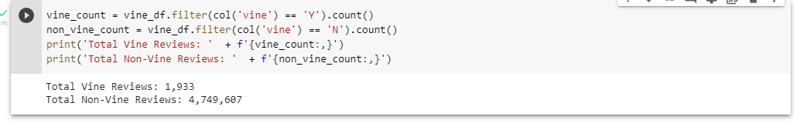
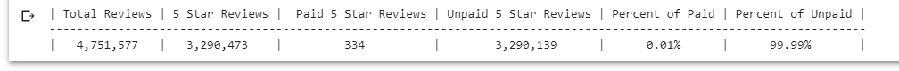

# Amazon_Vine_Analysis

## Overview
  This analysis is determine if there is a positivity bias for Amazon product reviews ratings performed by members of the paid Amazon Vine program compared to the non-paid reviews.

## Results 
  - There were 1,933 Vine reviews and 4,749,607 non-Vine reviews as seen below.
  
  
  
  - There were 334 Vine reviews that were 5 stars and 3,290,239 non-Vine reviews that were 5 stars.
  - 0.01% of Vine reviews were 5 stars and 99.99% of non-Vine reviews were 5 stars as seen in the below image.
  
  

## Summary
In your summary, state if there is any positivity bias for reviews in the Vine program. Use the results of your analysis to support your statement. 
There does not appear to be any positivity bias for reviews within the Vine program since about 0.01% of Vine reviews were 5 Stars. Comparing that to non-vine reviews where the 5 Star ratings made up 99.99% of all 5 star reviews.

To get a better understanding of the paid Vine reviews, we should consider looking at the distribution of all the paid Vine ratings.  This distributution should follow a normal curve where 5 star ratings and 1 star ratings would be at the extremes.
